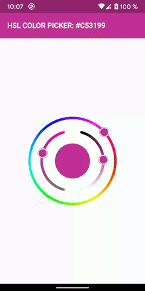

[](https://www.paypal.com/cgi-bin/webscr?cmd=_s-xclick&hosted_button_id=3HHNV9W5RGDPJ&source=url)

# hsl_colorpicker

A beatyfull HSL Color Picker for Flutter
Currently only supports Android and iOS!



## How to use it

### Installation

You just need to add `hsl_colorpicker` as a [dependency in your pubspec.yaml file](https://flutter.io/using-packages/).

```yaml
dependencies:
  hsl_colorpicker: ^1.0.1
```
Then run the flutter tooling:

```yaml
flutter packages get
```

### Usage
Put the `HSLColorPicker` widget as child of some other widget

```dart
import 'package:hsl_colorpicker/HSLColorPicker.dart';


HSLColorPicker(
  onChanged: (HSLColor color) {
    // Handle color changes
   },
),
```

### API

```dart
  /// Called during a drag when the user is selecting a color.
  /// Is the only required parameter.
  ///
  /// This callback called with latest HSLColor that user selected.
  final ValueChanged<HSLColor> onChanged;
  
  
  /// Initial color for picker.
  /// [onChanged] callback won't be called with initial value.
  ///
  /// Default value is Blue accent.
  final Color initialColor;


  /// The size of the ColorPicker.
  /// The size of the thumb is not included in the size of the ColorPicker,
  /// If the size of the thumb is greater than the strokeSize of the hue circle, it will be drawn beyond the size.
  ///
  /// Default value is 200 x 200.
  final double size;


  /// The width of hue color circle and saturation and lightness archs.
  ///
  /// Default value is relative to the size of the colorpicker.
  double strokeWidth;


  /// The size of each thumb in the picker.
  ///
  /// Default value is relative to the size of the colorpicker.
  double thumbSize;
  

  /// The size of each thumb strokes.
  ///
  /// Default value is relative to the size of the colorpicker.
  double thumbStrokeSize;
  

  /// Show or not the middle circle that indicates the selected color of the colorpicker.
  ///
  /// Default value is true.
  bool showCenterColorIndicator;
  

  /// The size of the middle circle that indicates the selected color of the colorpicker.
  /// The distance between the hue circle and the archs of lightness and saturation is determined by the size of the colorpicker and the   /// size of the middle circle that indicates the selected color.
  ///
  /// Default value is relative to the size of the colorpicker.
  bool centerColorIndicatorSize;  
```

### Example

```dart
import 'package:flutter/material.dart';
import 'package:hsl_colorpicker/HSLColorPicker.dart';

void main() {
  runApp(MyApp());
}

class MyApp extends StatelessWidget {
  // This widget is the root of your application.
  @override
  Widget build(BuildContext context) {
    return MaterialApp(
      home: ColorPickerPage(),
      debugShowCheckedModeBanner: false,
    );
  }
}

class ColorPickerPage extends StatefulWidget {
  @override
  _ColorPickerPageState createState() => _ColorPickerPageState();
}

class _ColorPickerPageState extends State<ColorPickerPage> {
  HSLColor hslColor = HSLColor.fromColor(Colors.blue);
  Color color = Colors.blue;

  @override
  Widget build(BuildContext context) {
    return Scaffold(
      backgroundColor: Colors.white,
      appBar: AppBar(
        backgroundColor: color,
        title: Stack(
          children: <Widget>[
            Text(
              "HSL COLOR PICKER: ${"#" + color.toString().split("0x")[1].toUpperCase().replaceFirst("FF", "").replaceAll(")", "")}",
              style: TextStyle(
                fontSize: 16,
                foreground: Paint()
                  ..style = PaintingStyle.stroke
                  ..strokeWidth = 1
                  ..color = Colors.grey,
              ),
            ),
            Text(
              "HSL COLOR PICKER: ${"#" + color.toString().split("0x")[1].toUpperCase().replaceFirst("FF", "").replaceAll(")", "")}",
              style: TextStyle(
                color: Colors.white,
                fontSize: 16,
              ),
            ),
          ],
        ),
      ),
      body: Center(
        child: Column(
          mainAxisAlignment: MainAxisAlignment.center,
          children: <Widget>[
            HSLColorPicker(
              onChanged: (colorSelected) {
                setState(() {
                  hslColor = colorSelected;
                  color = colorSelected.toColor();
                });
              },
              size: 200,
              strokeSize: 5,
              thumbSize: 9,
              thumbStrokeSize: 3,
              showCenterColorIndicator: true,
              centerColorIndicatorSize: 80,
              initialColor: Colors.blueAccent,
            ),
          ],
        ),
      ),
    );
  }
}
```
